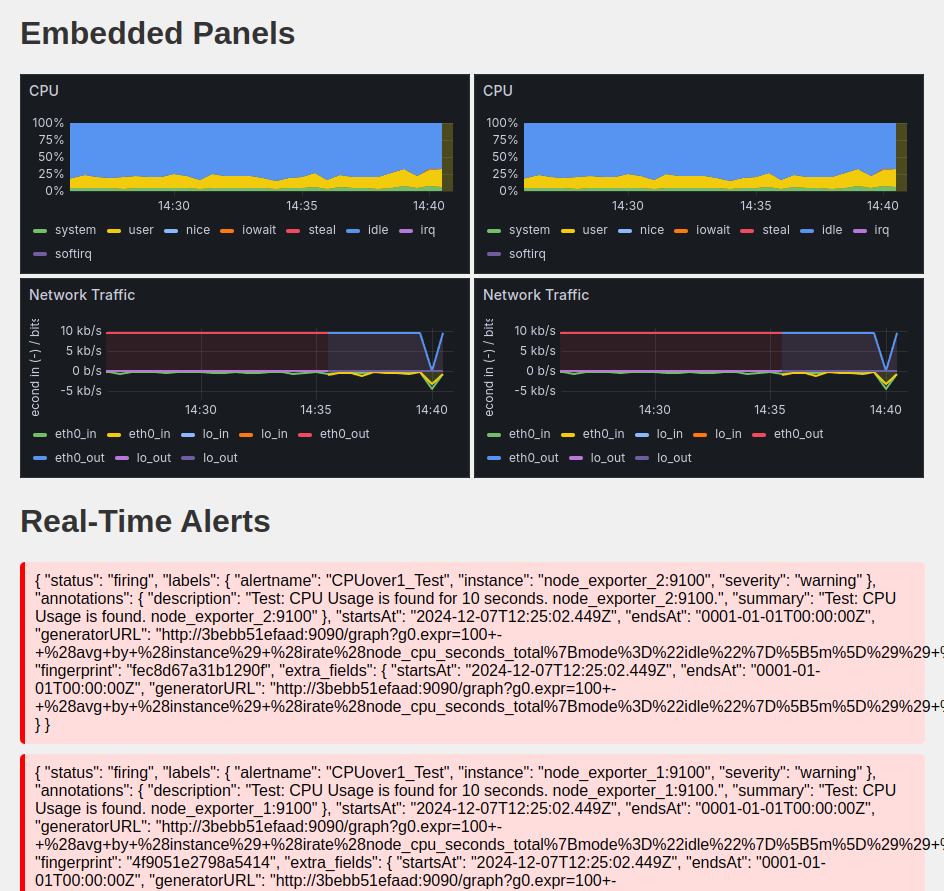

# Internship Ordinatrum: Monitoring System with Dockerized Prometheus, Grafana, Node Exporter, Grok Exporter, and Telegraf

This project sets up a comprehensive monitoring system for local wireless devices using Docker Compose. It integrates Prometheus, Grafana, Node Exporter, Grok Exporter, and Telegraf to collect and visualize system metrics. Additionally, the project includes an API that interacts with both Grafana and Prometheus to provide insights into device uptime, system performance, and potential issues. It also features notification management, signal processing, and data interpretation for proactive monitoring and management of local devices.

## Features

- **Easy Deployment:** Docker Compose for easy setup and management of services.
- **Monitoring Local Wireless Devices:** Use main computer to monitor local devices. 
- **System Resource Monitoring:** Uses Node Exporter and Telegraf to collect metrics from multiple nodes.
- **Visualization:** Grafana for real-time visualization and dashboards. API and WebSockets to interpret the data or alerts and visualize in real-time.
- **Log Parsing:** Grok Exporter parses logs and exports metrics to Prometheus.
- **Prometheus Integration:** Collects and stores time-series data locally for monitoring.
- **Custom API:** A Python FastAPI that interacts with Grafana and Prometheus to provide device monitoring and analysis.

## Prerequisites

- Docker (version 27.3.1)
- Docker Compose (version 1.29.2)

## Installation

### Main Computer

Install [install-main.sh](install-main.sh) to clone the repository and start the docker-compose.
```
chmod +x install_and_run.sh
./install-main.sh
```
```bash
#!/bin/bash

set -e

echo "Cloning the repository..."
git clone https://github.com/elymsyr/internship-ordinatrum.git
cd internship-ordinatrum/monitoring-system

# SET YOUR SMTP SETTINGS IF YOU USE

echo "SMTP_USER=myuser.com" > .env
echo "SMTP_PASSWORD=mypassword" >> .env
echo "SMTP_HOST=smtp.example.com:587" >> .env
echo "SMTP_FROM_ADRESS=example@gmail.com" >> .env

docker network create monitoring

echo "Building and starting Docker containers..."
docker-compose -f docker-compose-main.yml up -d

echo "Waiting for services to start..."
sleep 5
docker-compose -f docker-compose-main.yml ps

echo "Docker containers are running. You can access Grafana at http://localhost:3000"

echo "To access Grafana, use the default login credentials:"
echo "Username: admin"
echo "Password: admin"

xdg-open API/app/alert_api_test.html

xdg-open http://localhost:3000/
xdg-open http://localhost:9090/
xdg-open http://localhost:9093/
xdg-open http://0.0.0.0:8000/docs

docker logs fastapi
echo "Installation and setup completed!"
```

The script [add_source_n_dashboard.sh](add_source_n_dashboard.sh) is not working properly. Please add the data source (Prometheus) and the dashboards (Examples: [dashboard1](monitoring-system/dashboards/dashboard1.json) and [dashboard2](monitoring-system/dashboards/dashboard2.json)) by hand.

*If you get any error related to the data source uid, be sure that the data source uid is same with the one in the dashboard json files. Create a new datasource with hand and find data source uid by checking the new data source's JSON. Change the data source uid in the dashboard1.json and dashboard2.json files. Import files to Grafana again.*

### Local Devices

Install [install-device.sh](install-device.sh) to clone the repository and start the docker-compose (node_exporter).
```
chmod +x install_and_run.sh
./install-device.sh
```

## API Documentation

### Endpoints

#### `/grafana/dashboards`

- **Method**: `GET`
- **Description**: Fetch the list of Grafana dashboards.

#### `/grafana/dashboard/{uid}`
- **Method**: `GET`
- **Description**: Fetch a Grafana dashboard by UID.
- **Query Parameters**:
    - `uid`: The UID of the Grafana dashboard you want to fetch (required).

#### `/prometheus/query`

- **Method**: `GET`
- **Description**: Query Prometheus data using the provided query and optional time range.
- **Query Parameters**:
    - `query`: PromQL query (required).
    - `start`: Start time of the query (optional, in ISO format or relative time, e.g., '10minute').
    - `end`: End time of the query (optional, default is 'now').
    - `step`: Step duration for data points (optional, e.g., '60s').

#### `/prometheus/device_info`

- **Method**: `GET`
- **Description**: Fetch Prometheus data for specific device metrics over a time range.
- **Query Parameters**:
    - `start`: Start time for the data query (optional, default is '30minute').
    - `end`: End time for the data query (optional, default is 'now').
    - `metrics`: Dictionary of Prometheus queries (optional).
    - `step`: Step duration for data points (optional, default is '60s').

#### `/alerts/jobs`
- **Method**: `POST`
- **Description**: Receive an alert group and broadcast it to all connected WebSocket clients. The payload is validated using the AlertGroup model, logged, and added to the list of alerts.
- **Request Body**: [See AlertGroup(BaseModel) and Alert(BaseModel)](monitoring-system/API/app/helper.py)

#### `/ws/alerts`
- **Method**: `WebSocket`
- **Description**: WebSocket endpoint for clients to receive real-time alerts. When an alert is posted via /alerts/jobs, it is broadcast to all connected WebSocket clients. The endpoint also allows clients to send messages that the server will echo back.


<div style="display: flex; justify-content: center; align-items: center; height: fit; flex-direction: column; text-align: center;">
    
    <a href="monitoring-system/API/app/alert_api_test.html" style="underline-style: none; color: inherit;">
        <h5>Raw Alert Notification with Embedded Panels</h5>
    </a>
</div>

## Security Notice

This project is primarily focused on functionality and does not include extensive security features or practices. It is recommended that you review and implement necessary security measures before using this project in a production environment. This includes, but is not limited to, securing API endpoints, encrypting sensitive data, and ensuring proper access control.

**Disclaimer:** The author assumes no responsibility for any security vulnerabilities or damages that may occur through the use of this project. *Use at your own risk.*